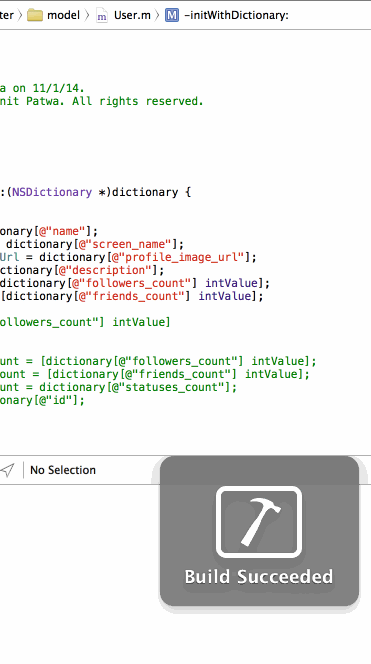

Twitter
=======
Twitter app developed as part of Codepath iOS Bootcamp

Assignment 4:

Time spent: approximately 10 hours

Features
---------
#### Required
Hamburger menu
Dragging anywhere in the view should reveal the menu.
The menu should include links to your profile, the home timeline, and the mentions view.
The menu can look similar to the LinkedIn menu below or feel free to take liberty with the UI.
Profile page
Contains the user header view
Contains a section with the users basic stats: # tweets, # following, # followers
Home Timeline
Tapping on a user image should bring up that user's profile page

Video Walk thru
---------------

Assignment 3:

Time spent: approximately 10 hours

Features
---------
#### Required
- [x] User can sign in using OAuth login flow
- [x] User can view last 20 tweets from their home timeline
- [x] The current signed in user will be persisted across restarts
- [x] In the home timeline, user can view tweet with the user profile picture, username, tweet text, and timestamp. 
- [x] User can pull to refresh
- [x] User can compose a new tweet by tapping on a compose button.
- [x] User can tap on a tweet to view it, with controls to retweet, favorite, and reply.

#### Optional
- [x] Retweeting and favoriting should increment the retweet and favorite count.
- [x] User should be able to unretweet and unfavorite and should decrement the retweet and favorite count.

Video Walk thru
---------------

